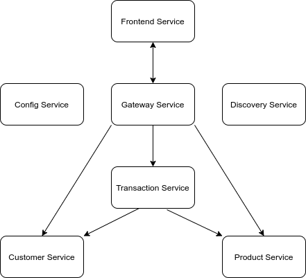

# Microservices with Spring Cloud
<div style="color: red">
  Still W.I.P.
</div>

##Introduction
Example project for self-training done by me (Tomás GARCÍA-POZUELO - http://github.com/oleuzop)

The objective of this project is to do a complete microservices web shop application using:

- **JDK 11**
- **Spring Boot**
- **Spring Cloud**
  - **Config Server** for centralized configuration for all microservices.
  - **Eureka** as discovery service.
  - **Spring Gateway** as load balancer (& gateway).
  - **OpenFeign** for communication.
- **Swagger** (OpenAPI) for client API documentation.
- **Docker**(ized) containers for local machine deployment.
- **Spring Data** using **H2** memory database (JPA).
- **Angular** for the frontend, integrated in a Maven project. Using **Material**.

##Future work (TODO - Backlog):
- Add **Spring Security**.
- Integrate with **Oauth2** using **Keycloak**.
- Create better **Integration Tests** in Spring Cloud disabling Eureka and the Gateway.
- Implement the whole shop, with users, products and shopping chart.
- Deploy in **Kubernetes** environment using Ingress and Pods.
- Change config server to use git and get rid of the `native` mode.
- Centralize DTOs in one single dependency project to be shared by all projects.


### Usage

In the most cases you need to have Maven, JDK11+ & docker.

To launch the application it should be enough to launch: ```./startWithDocker.sh``` in the parent folder.

The best way to run the sample applications individually is with IDEs like IntelliJ IDEA.

## Architecture

Our sample microservices-based system consists of the following modules:
- **gateway-service** - a module that Spring Cloud Gateway Service for running Spring Boot application that acts as a proxy/gateway in the architecture.
- **config-service** - a module that uses Spring Cloud Config Server for running configuration server in the `native` mode. The configuration files are placed on the classpath. (Git configuration to be done in the future)
- **discovery-service** - a module that uses Spring Cloud Netflix Eureka as an embedded discovery server.
- **customer-service** - a module containing the first of our sample microservices that allows to perform CRUD operation on in-memory repository of customers
- **product-service** - a module containing the second of our sample microservices that allows to perform CRUD operation on in-memory repository of products. 
- **transaction-service** - a module containing the third of our sample microservices that allows to perform CRUD operation on in-memory repository of transactions. It communicates with both customer-service and transaction-service.

The following picture illustrates the architecture described above.



